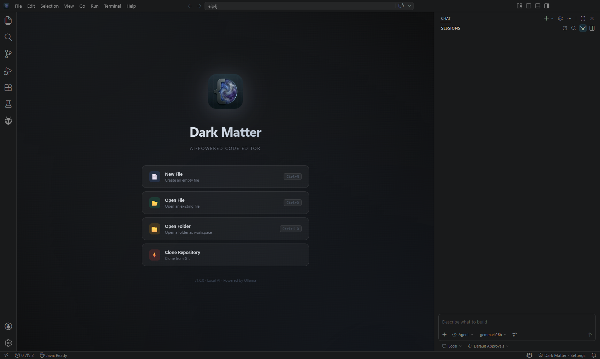

# Dark Matter IDE

**AI-Powered Code Editor with Built-in Ollama Integration**

Dark Matter is an open-source code editor forked from [VS Code OSS](https://github.com/microsoft/vscode), designed to provide local AI assistance directly within the development workflow. It requires no cloud APIs, no subscriptions, and ensures that no project data leaves the local machine.

<p align="center">
  
</p>

---

## Key Features

### Built-in Ollama AI Chat
Dark Matter includes a fully integrated Ollama chat agent. Users can install [Ollama](https://ollama.com), download a model, and begin interacting with the AI directly within the editor environment.

*   **Zero Configuration**: Works out of the box with local Ollama instances.
*   **Model Flexibility**: Compatible with Gemma, Llama, Mistral, CodeLlama, DeepSeek, and other Ollama models.
*   **100% Private**: All AI processing occurs locally on the user's hardware.
*   **Workspace Awareness**: The AI agent understands the project structure and local file contents.
*   **Remote Server Support**: Capability to connect to an Ollama instance running on any machine within the network.

### High-Context Awareness
Dark Matter is configured to request a **256k token context window** by default. This allows the AI to maintain professional-grade awareness of large files and complex project structures during chat sessions.

### Extension Marketplace
Full access to the [Open VSX Registry](https://open-vsx.org/), allowing users to install thousands of extensions for language support, themes, debugging, and productivity.

### Core Development Features
Dark Matter retains all standard features of the VS Code ecosystem, including IntelliSense, an integrated terminal, Git support, and advanced debugging.

---

## Hardware Requirements

> [!IMPORTANT]
> **GPU Memory (VRAM) Warning**
>
> Dark Matter requests a very large context window (256,000 tokens) to ensure the AI understands your entire project. This requires significant GPU VRAM.
>
> **Users must ensure their hardware has enough total VRAM to accommodate both the Model and the Context Window.**
>
> *   **Model Size**: A 7B-9B model typically requires ~5-8GB of VRAM.
> *   **Context Overhead**: A 256k context window can add an additional **4GB to 8GB** of VRAM overhead depending on the model architecture.
>
> If you experience "100% CPU usage" or slow responses, it usually means Ollama has run out of GPU memory and is falling back to the CPU. In this case, consider using a smaller model or reducing project size.

---

## Getting Started

### Prerequisites
1.  **Node.js** (v18 or later)
2.  **Ollama** — [Available for download here](https://ollama.com/download)

### Installation and Setup
```bash
# Install Ollama and pull a recommended model
ollama pull gemma2:9b
```

### Building from Source
```bash
# Clone the repository
git clone https://github.com/abmina/dark-matter-ide.git
cd dark-matter-ide

# Install dependencies
npm install

# Build and launch on Windows
yarn run gulp vscode-win32-x64-min
.\scripts\code.bat
```

### Using the AI Agent
1.  Ensure the Ollama server is active (`ollama serve`).
2.  Launch Dark Matter.
3.  Open the Chat panel from the primary sidebar.
4.  Select the desired model from the dropdown menu and begin the session.

---

## Architecture

Dark Matter extends VS Code OSS with the following components:

| Component | Description |
|-----------|-------------|
| **Ollama Chat Agent** | Integrated chat participant managing local AI communication. |
| **Language Model Provider** | Registers Ollama models as first-class providers within the IDE. |
| **Large Context Integration** | Pre-configured 256k context awareness for deep project understanding. |
| **Custom Welcome UI** | Professional startup experience tailored for AI-driven development. |

---

## Privacy and Security
Dark Matter is designed with a privacy-first architecture. All AI features are executed locally:
*   No project data is transmitted to external servers.
*   No third-party API keys or accounts are required.
*   Telemetry and usage tracking are disabled by default.

---

## Contributing
Contributions to the project are reviewed and welcomed. 
1.  Fork the repository.
2.  Develop features in a dedicated branch (`git checkout -b feature/name`).
3.  Commit changes with descriptive messages.
4.  Submit a Pull Request for review.

---

## License
Licensed under the [MIT License](LICENSE.txt). Dark Matter is a fork of [Visual Studio Code - Open Source](https://github.com/microsoft/vscode).

---

## Acknowledgments
*   The Microsoft VS Code team for the foundational platform.
*   The Ollama team for democratizing local LLM access.
*   The Open VSX Registry for maintaining an open extension ecosystem.
